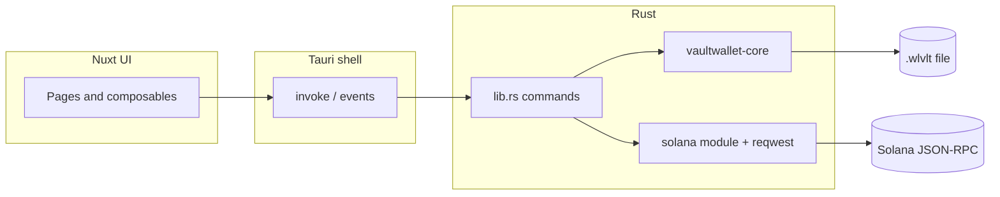

# VaultWallet

Desktop app for managing **Solana wallets** inside an **encrypted vault** (`.wlvlt`). The UI is a **Nuxt** single-page app hosted inside **Tauri 2**; all vault I/O and crypto run in **Rust** via [vaultwallet-core](vaultwallet-core/), which implements a **KDBX 4.1–compatible** on-disk format (same binary layout as KeePass 4.x, with a VaultWallet-specific extension and branding).

## Purpose

- Store **public keys, private keys, balances, and optional funding metadata** in a hierarchical vault (folders and entries), protected by a **master password** and **Argon2** KDF (strength presets from quick to maximum memory cost).
- **Never rely on the browser for secrets**: opening, saving, and mutating the vault happen through Tauri **commands** that call `vaultwallet-core` on the native side.
- Optionally enrich entries with **Solana RPC** data: derive a public key from a private key, refresh **balances**, and run a lightweight **funding trace** to label where funds may have come from (using curated exchange hot-wallet lists in `vaultwallet/config/exchange-wallets.json`).

## How it works



1. **Gate screen** — You open an existing `.wlvlt` or create one (path + password + KDF preset). The password is kept in memory for the session so the UI can re-invoke save operations; it is not written to disk by the front end.
2. **Vault tree** — Groups map to folders; entries hold string fields (`Title`, `PublicKey`, `PrivateKey`, `Balance`, `Funding`, plus any custom keys). The Rust side loads the database, applies changes, and **atomically saves** back to disk.
3. **Solana helpers** — Commands such as `solana_fetch_balance` and `solana_trace_funding` call your configured RPC URL from the **Nuxt public runtime config** (see below). Tracing compares incoming transfer sources against known exchange deposit addresses to populate human-readable **funding** labels in the UI.

## Repository layout

| Path | Role |
|------|------|
| [`vaultwallet/`](vaultwallet/) | Nuxt 4 + Vue 3 + Tailwind; Tauri app manifest and `src-tauri/` Rust crate |
| [`vaultwallet-core/`](vaultwallet-core/) | GPL-3.0 Rust library: KDBX4-compatible `open` / `save`, encryption, XML inner format |
| `vaultwallet/config/exchange-wallets.json` | Exchange name → Solana address list used for funding hints |

## Prerequisites

- [Rust](https://www.rust-lang.org/tools/install) (stable) and platform **Tauri** deps ([prerequisites](https://v2.tauri.app/start/prerequisites/))
- [Bun](https://bun.sh/) (or another package manager compatible with the lockfile)

## Development

```bash
cd vaultwallet
bun install
bun run tauri dev
```

This starts the Nuxt dev server and opens the Tauri window. For web-only UI work (no native APIs):

```bash
cd vaultwallet
bun install
bun run dev
```

## Production build

```bash
cd vaultwallet
bun install
bun run tauri build
```

Bundled artifacts are produced under `vaultwallet/src-tauri/target/release/bundle/` (per Tauri defaults).

## Configuration

- **Solana RPC** — Set `NUXT_PUBLIC_SOLANA_RPC_URL` (e.g. in `vaultwallet/.env`) to point at your RPC provider. If unset, the app falls back to the public mainnet endpoint (fine for testing; use a dedicated provider for production).

## Security notes

- Treat **private keys** and your **master password** as highly sensitive. The app is a local tool; you are responsible for backup, malware protection, and safe RPC providers.
- The **`vaultwallet-core`** crate is **GPL-3.0**. If you distribute binaries that link it, comply with the GPL. See [`vaultwallet-core/README.md`](vaultwallet-core/README.md) for format details and licensing context.

## Further reading

- [vaultwallet-core README](vaultwallet-core/README.md) — file extension `.wlvlt`, API sketch, format status
- [Tauri 2](https://v2.tauri.app/) — desktop packaging and security capabilities
- [Nuxt 4](https://nuxt.com/) — UI framework used by the shell
